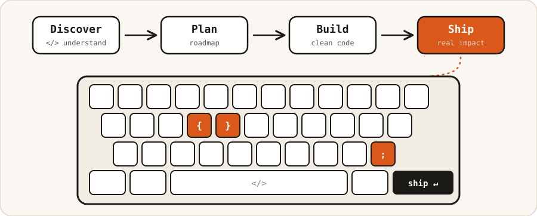

<h1 align="center">Hi, I'm Rami Alkhateeb 👋</h1>
<h3 align="center">Senior Software Engineer — .NET · Azure · Microservices · AI-Assisted Engineering</h3>

  <em>I turn hard business problems into software that ships.</em> 
  8 years · 3 countries · enterprise platforms serving 6M+ customers

  
  
  
  

  

---

### About me

I build production software that stays solid under real use — as comfortable inside a shared component library as in a stakeholder meeting. My work spans implementation, architecture, technical mentoring, and direct collaboration with Product Owners and business stakeholders, most recently on a microservices-based enterprise platform in Germany.

### Engineering impact

|  |  |  |
|---|---|---|
| **8** years experience | **~30** reusable UI/platform components | **5+** enterprise services modernized |
| **6M+** telecom customers served | **4** enterprise Azure projects | **~20%** performance improvement |

### What I do

- **Software Engineering** — .NET, C#, ASP.NET Core, Angular, APIs, and databases
- **Architecture & Cloud** — Microservices, Azure, distributed systems, integrations, and modernization
- **Technical Leadership** — Reviews, planning, technical decisions, and stakeholder collaboration
- **AI-Assisted Engineering** — Codex and Claude Code for implementation, analysis, documentation, and controlled delivery

---

### What I build outside the day job

- **[NxT7](https://ramialkhateeb.github.io/nxt7.html)** — my independent product studio: small, focused, Arabic-friendly apps built and shipped end to end (Carousel Engine, Syria FM, Makdous, Task Breaker)
- **Courses** *(coming soon)* — hands-on courses for developers, from fundamentals to shipping real products with AI-assisted engineering

---

### Stack

**Primary**

**Core expertise:** C# / .NET · ASP.NET Core · Angular · TypeScript · Azure · Microservices · SQL Server · PostgreSQL · Redis · RabbitMQ · Docker · CI/CD · xUnit · Angular Material · REST APIs · Clean Architecture

**Also use**

---

### The road so far

**Damascus → Dubai → Germany**

- **HILTES Software GmbH**, Leer, Germany — Senior Software Engineer *(2026–present)*
- **CARMA**, Dubai, UAE — Software Engineer *(2022–2025)*
- **Tech Unicorn**, Dubai, UAE — Software Developer *(2021–2022)*
- **Syriatel Mobile Telecom**, Damascus, Syria — Software Developer *(2018–2019)*

**Education**
B.Sc. Software Engineering and Information Systems — Al-Baath University
Decision Support Systems Program — HIAST
German Language Preparation (DSH) — Paderborn University

**Languages**
Arabic (Native) · English (Full Professional) · German (B2)

---

  <em>Open to Senior Software Engineer / Tech Lead opportunities in Germany.</em> 
  <a href="https://ramialkhateeb.github.io">Portfolio</a> ·
  <a href="https://linkedin.com/in/rami13alkhateeb">LinkedIn</a> ·
  <a href="https://github.com/ramialkhateeb">GitHub</a> ·
  <a href="mailto:rami13alkhateeb@gmail.com">Email</a>

